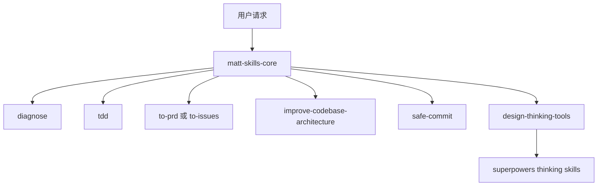

# Agentic Workflow：最新共享版

## 为什么更新

旧版仓库以 Phase 0-4 生命周期为主，容易把简单任务也推入重型流程。最新私有 skills 库已经收敛为更薄的路由方式：规则只负责判断任务类型，真正的执行纪律交给对应 skill。

## 核心模型

## 编程任务路由

- Bug、异常、失败测试、性能退化：`diagnose`。先建立可重复反馈环，再假设、插桩、修复和回归测试。
- 新功能或修复需要锁定行为：`tdd`。用 tracer-bullet 垂直切片，一次一个测试，一次一个实现。
- 需要 PRD：`to-prd`。从当前上下文合成 PRD，不重新访谈用户。
- 需要拆任务：`to-issues`。把计划拆成可独立交付的垂直切片。
- 架构摩擦或难测试：`improve-codebase-architecture`。寻找浅模块和可深化的 seam。
- 提交：`safe-commit`。提交前检查范围、排除无关过程文件，说明纳入和排除内容。

## 非编码任务路由

`design-thinking-tools.mdc` 接管暂不编码、只讨论方案、需求探索、思维工具、skill/process 文档等任务，并路由到 Superpowers 的 brainstorming、inversion、scale-game、meta-pattern 等工具。

## 护栏

`ai-coding-protocol.mdc` 只保留跨任务通用的安全线：最小有效改动、先读后写、先复用再发明、测试行为不测内部、有验证再收尾、不提交秘密。

## 连续性

`agent-continuity-protocol.mdc` 要求新会话先确认仓库状态，长任务维护任务账本，首次编辑文件前重新读取磁盘内容，避免覆盖用户或其他 agent 的改动。

## 同步边界

本共享版已脱敏：不包含个人画像、私有路径、内网仓库、业务项目名和公司专项规则。
