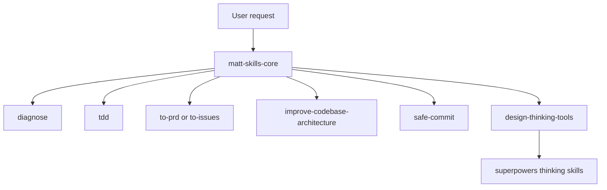

# Agentic Workflow: Current Shared Version

## Why This Update

The old repository centered on a Phase 0-4 lifecycle, which often made simple work too heavy. The latest private skills library has moved to a thinner routing model: rules identify the task type, and focused skills carry the execution discipline.

## Core Model

## Coding Routes

- Bugs, exceptions, failing tests, performance regressions: `diagnose`. Build a deterministic feedback loop before hypothesizing, instrumenting, fixing, and regression testing.
- Features or fixes whose behavior should be locked down: `tdd`. Use tracer-bullet vertical slices: one test, one implementation, repeat.
- PRDs: `to-prd`. Synthesize from current context rather than re-interviewing the user.
- Implementation issues: `to-issues`. Break a plan into independently shippable vertical slices.
- Architectural friction or hard-to-test code: `improve-codebase-architecture`. Look for shallow modules and seams that can be deepened.
- Commits: `safe-commit`. Check scope, exclude unrelated process artifacts, and state what is included and excluded.

## Non-Coding Routes

`design-thinking-tools.mdc` handles no-code design discussion, requirements exploration, thinking tools, and skill/process documentation. It routes to Superpowers tools such as brainstorming, inversion, scale-game, and meta-pattern recognition.

## Guardrails

`ai-coding-protocol.mdc` keeps cross-task safety rules: smallest effective change, read before write, reuse before inventing, behavior-oriented tests, evidence before completion, and no secrets in commits.

## Continuity

`agent-continuity-protocol.mdc` asks agents to refresh repo state at session start, keep task ledgers for long work, and reread target files before first edits to avoid overwriting user or agent changes.

## Sanitization Boundary

This shared version is sanitized. It excludes personal profiles, private paths, internal repositories, product-specific names, and company-specific rules.
